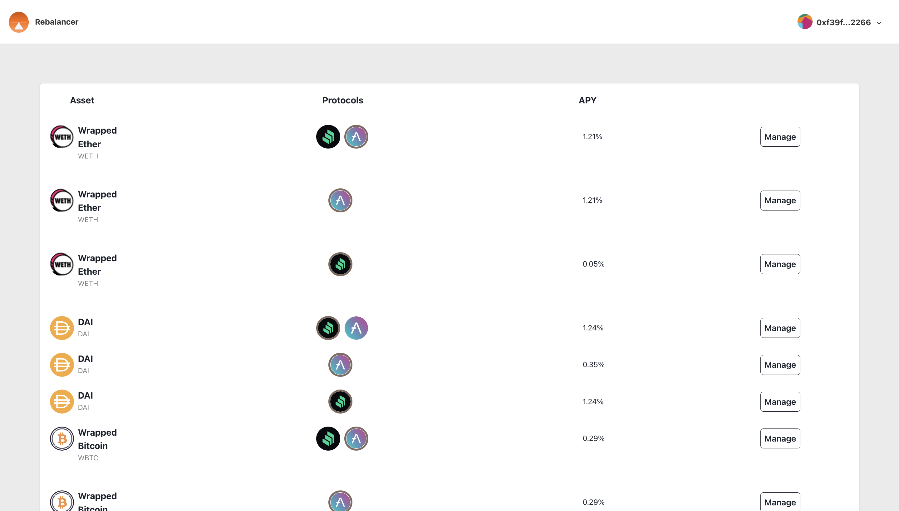

# Rebalancer

## Overview

A Rebalancing app that rebalance users' assets progamatically, leveraging Compound and Aave to provide the maximum return of assets. Rebalancer will check for rebalancing opportunities whenever a user deposit or withdraw from the pool. If there is a protocol with higher APY than the current leveraged protocol, Rebalancer will shift assets from the current protocol to the protocol with higher APY.

Upon depositing into a pool, users will receive corresponding rTokens.

Includes a nextJS frontend to interact with the smart contracts.

## Getting Started

### Prerequisites

- Node and Node Package Manager (NPM)

  > [Installation guide](https://docs.npmjs.com/downloading-and-installing-node-js-and-npm)

- MetaMask web extension

### Installation

1. Install hardhat package dependencies.

   ```bash
   cd hardhat
   npm install
   ```

2. **_[For running debug only]_** Install nextJS package dependencies.

   ```bash
   cd ../next-js
   npm install
   ```

## Usage

### Run application

1. Enter `hardhat` folder

   ```bash
   cd hardhat
   ```

2. Start a local node

   ```bash
   npx hardhat node
   ```

3. Switch MetaMask network to localhost

   > [Step-by-step guide of adding Hardhat network to metamask](https://support.chainstack.com/hc/en-us/articles/4408642503449-Using-MetaMask-with-a-Hardhat-node)

4. Import Hardhat Account #0 into MetaMask

   1. From the terminal, copy the private key of Account #0

   - For e.g.,

     ```
     Account #0: 0xf39Fd6e51aad88F6F4ce6aB8827279cffFb92266 (10000 ETH)
     Private Key: 0xac0974bec39a17e36ba4a6b4d238ff944bacb478cbed5efcae784d7bf4f2ff80
     ```

     Copy `0xac0974bec39a17e36ba4a6b4d238ff944bacb478cbed5efcae784d7bf4f2ff80` to clipboard

   2. Click on MetaMask extension
   3. Click on the Avatar > Import Account
   4. Paste the private key

   **CAUTION: DO NOT TRANSFER ACTUAL FUNDS INTO THIS WALLET**

5. Open a new terminal and enter `hardhat` folder

   ```bash
   cd hardhat
   ```

6. Deploy the smart contracts onto localhost network

   ```bash
   npx hardhat run scripts/deploy.js --network localhost
   ```

7. (Optional) Import Rebalancer Tokens to MetaMask portfolio

   > [Import guide](https://support.ledger.com/hc/en-us/articles/6375103346077-Add-custom-tokens-to-MetaMask?docs=true)

   Example: The following text is generated upon deployment of smart contracts

   ```
   WETH ManageMultiple is deployed to:  0xE7FF84Df24A9a252B6E8A5BB093aC52B1d8bEEdf
   Rebalancer token is deployed to:  0x7036124464A2d2447516309169322c8498ac51e3

   WETH ManageAave is deployed to:  0x92A00fc48Ad3dD4A8b5266a8F467a52Ac784fC83
   Rebalancer token is deployed to:  0xB1c05b498Cb58568B2470369FEB98B00702063dA

   ManageComp deployed!
   WETH ManageComp is deployed to:  0x44863F234b137A395e5c98359d16057A9A1fAc55
   Rebalancer token is deployed to:  0x21915b79E1d334499272521a3508061354D13FF0
   ```

   Each paragraph of addresses corresponds to its respective position in the dashboard's pool list.
   
   The first pool, which leverages both Compound and Aave, in the image has the contract address of `0xE7FF84Df24A9a252B6E8A5BB093aC52B1d8bEEdf` and its rTokens contract is deployed to the address `0x7036124464A2d2447516309169322c8498ac51e3`. After making a transaction with the first pool, the balance of rToken will be changed. And, to view the updated balance, the user has to import `0x7036124464A2d2447516309169322c8498ac51e3` into MetaMask.

   Continuing from the generated text above, the address of rToken of the second pool, which only utilize Aave, is `0xB1c05b498Cb58568B2470369FEB98B00702063dA`.

8. Fund HardHat Account #0 with 50 ETH worth of WETH, DAI, and WBTC.

   ```bash
   npx hardhat run scripts/fund-account.js --network localhost
   ```

9. Enter `next-js` folder

   ```bash
   cd ../next-js
   ```

10. Run the frontend

    ```bash
    npm run dev
    ```

11. Launch a browser with MetaMask extension and access the url:

    ```
    localhost:3000
    ```

12. Login with Hardhat Account #0 to access Rebalancer's functionalities.

---

## Troubleshooting

**Upon logging in and waiting for a minute, yet no pools are displayed.**

Check the first terminal, if the error is regarding invalid block tag. Reset Hardhat Account #0, using the [guide](https://support.metamask.io/hc/en-us/articles/360015488891-How-to-reset-an-account).
<br/><br/><br/>
**When transactions are not going through due to invalid nonce**

Similar to the solution of the first problem, an account reset is required.

---

## Extras

### Compile smart contracts

```
yarn hardhat compile
```

### Run tests

To run all of the tests in the `hardhat` directory.

```
cd hardhat
yarn hardhat test
```

### Run tests with coverage tool

To run all of the tests in the `hardhat` directory and check the code coverage.

```
cd hardhat
yarn hardhat coverage
```
